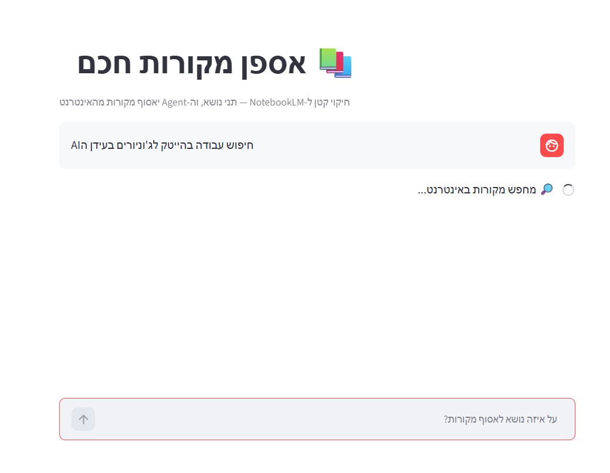

# 📚 אספן מקורות חכם — NotebookLM בקטנה

חיקוי מינימלי ל‑[NotebookLM](https://notebooklm.google.com/) של גוגל, שמתמקד בשלב **איסוף המידע**: סוכן (Agent) חכם שמקבל נושא, מחפש מקורות באינטרנט באופן עצמאי, נותן למשתמש לבחור אילו מקורות לכלול, ולבסוף כותב סיכום ראשוני.

הפרויקט נבנה עם **LangChain**, מנוע החיפוש **Tavily**, ומודל **Google Gemini**, וכולל ממשק משתמש ב‑**Streamlit**.

---

## ✨ מה הסוכן יודע לעשות?

- 🔎 **חיפוש אוטונומי** — הסוכן מחליט בעצמו אילו שאילתות חיפוש להריץ וכמה, כדי לכסות את הנושא מכמה זוויות.
- 🧑‍⚖️ **Human in the Loop** — הסוכן עוצר ומציג למשתמש את רשימת המקורות שמצא. המשתמש בוחר אילו לאשר ואילו לדחות.
- 🧠 **זיכרון (Checkpointer)** — הסוכן זוכר את מצב השיחה, כך שהוא יכול לעצור לאישור ולהמשיך מאותה נקודה.
- 📝 **סיכום ראשוני** — לפי המקורות שאושרו, הסוכן כותב סיכום שנותן תמונה כללית על הנושא.

---

## 🖼️ איך זה נראה?



<details>
<summary>הדמיית טקסט (אם אין עדיין צילום מסך)</summary>

**שלב 1 — המשתמש נותן נושא, והסוכן אוסף מקורות:**

```
┌─────────────────────────────────────────────────────────┐
│ 📚 אספן מקורות חכם                                       │
│ חיקוי קטן ל-NotebookLM — תני נושא, וה-Agent יאסוף מקורות │
├─────────────────────────────────────────────────────────┤
│                                  השפעת השינה על הזיכרון 🧑 │
│                                                          │
│ 🔎 מחפש מקורות באינטרנט...                                │
└─────────────────────────────────────────────────────────┘
```

**שלב 2 — הסוכן עוצר ומציג מקורות לבחירה (HITL):**

```
┌─────────────────────────────────────────────────────────┐
│ 📋 מצאתי 5 מקורות. בחרי אילו לכלול:                       │
│                                                          │
│  ☑  חוקרים מצאו שיטה לחזק את הזיכרון תוך כדי שינה          │
│      🔗 https://www.tau.ac.il/research/memory-smell      │
│      מחקר על חיזוק התגבשות הזיכרון במהלך השינה...         │
│                                                          │
│  ☑  התגבשות זיכרון – ויקיפדיה                             │
│      🔗 https://he.wikipedia.org/wiki/...                │
│      תהליך מעבר המידע מזיכרון קצר-טווח לארוך-טווח...      │
│                                                          │
│  ☐  בלוג שיווקי (בוטל ע"י המשתמש)                         │
│      🔗 https://example.co.il/...                        │
│                                                          │
│            [ ✅ אשר והמשך לסיכום ]                         │
└─────────────────────────────────────────────────────────┘
```

**שלב 3 — הסוכן כותב סיכום על בסיס המקורות שאושרו:**

```
┌─────────────────────────────────────────────────────────┐
│ 📝 על בסיס המקורות שבחרת:                                 │
│                                                          │
│ שינה ממלאת תפקיד מרכזי בהתגבשות הזיכרון. במהלך שלבי       │
│ השינה העמוקה ושנת ה-REM, המוח מעבד ומחזק זיכרונות        │
│ שנוצרו במהלך היום... (סיכום מלא)                         │
└─────────────────────────────────────────────────────────┘
```

</details>

---

## 🛠️ סטאק טכנולוגי

| רכיב | תפקיד |
|------|--------|
| [LangChain](https://docs.langchain.com/) | בניית ה-Agent (`create_agent`) |
| [Tavily](https://tavily.com/) | מנוע חיפוש אינטרנטי שנבנה במיוחד עבור Agents |
| [Google Gemini](https://ai.google.dev/) | מודל השפה (המוח של ה-Agent) |
| [LangGraph](https://langchain-ai.github.io/langgraph/) | זיכרון (Checkpointer) ו-Human in the Loop |
| [Streamlit](https://streamlit.io/) | ממשק המשתמש |

---

## 🚀 התקנה והרצה

### דרישות מקדימות
- Python 3.10+
- מפתח API ל-[Google AI Studio](https://aistudio.google.com/apikey) (חינם)
- מפתח API ל-[Tavily](https://app.tavily.com) (חינם, 1,000 חיפושים בחודש)

### שלבים

```bash
# 1. שכפול הריפו
git clone <your-repo-url>
cd <repo-folder>

# 2. יצירת סביבה וירטואלית
python -m venv venv

# 3. הפעלת הסביבה
#    Windows (PowerShell):
.\venv\Scripts\Activate.ps1
#    macOS / Linux:
source venv/bin/activate

# 4. התקנת התלויות
pip install -r requirements.txt
```

### הגדרת מפתחות
צרי קובץ `.env` (אפשר להעתיק מ-`.env.example`) ומלאי:

```env
GOOGLE_API_KEY=המפתח_שלך_מ-google_ai_studio
TAVILY_API_KEY=המפתח_שלך_מ-tavily
GEMINI_MODEL=gemini-2.5-flash
```

### הרצה

**ממשק גרפי (מומלץ):**
```bash
streamlit run app.py
```
ואז פתחי את הדפדפן בכתובת `http://localhost:8501`.

**מהטרמינל:**
```bash
python agent.py
```

---

## 💬 דוגמאות לשאלות / נושאים

הסוכן עובד מצוין על נושאים שדורשים איסוף מידע ממקורות מגוונים. לדוגמה:

- `השפעת השינה על הזיכרון`
- `יתרונות בריאותיים של תה ירוק`
- `מהי בינה מלאכותית גנרטיבית?`
- `שיטות ללימוד יעיל לפני מבחנים`
- `ההיסטוריה של חקר החלל`
- `יתרונות וחסרונות של עבודה מהבית`

---

## 📁 מבנה הפרויקט

```
.
├── agent.py            # הלוגיקה של ה-Agent (מודל, כלים, HITL, זיכרון)
├── app.py              # ממשק המשתמש ב-Streamlit
├── requirements.txt    # תלויות הפרויקט
├── .env                # מפתחות סודיים (לא עולה ל-Git)
├── .env.example        # תבנית למפתחות
└── README.md           # הקובץ הזה
```

---

## 🧩 איך זה עובד בפנים?

```
        נושא מהמשתמש
             │
             ▼
   ┌───────────────────┐      שאילתות      ┌──────────────┐
   │   Agent (Gemini)  │ ───────────────▶ │    Tavily    │
   │   create_agent    │ ◀─────────────── │   (חיפוש)    │
   └───────────────────┘     מקורות       └──────────────┘
             │
             ▼
   🛑 HITL — present_sources
   (המשתמש בוחר אילו מקורות לאשר)
             │
             ▼
   ┌───────────────────┐
   │   סיכום ראשוני     │
   └───────────────────┘
```

ה-`HumanInTheLoopMiddleware` עוצר את הסוכן לפני הפעלת הכלי `present_sources`, מציג למשתמש את המקורות, ולפי בחירתו (אישור / סינון / דחייה) הסוכן ממשיך לכתוב את הסיכום. ה-`Checkpointer` (זיכרון) הוא שמאפשר את העצירה וההמשך.

---

## 📜 רישיון

פרויקט לימודי — חופשי לשימוש ולמידה.
